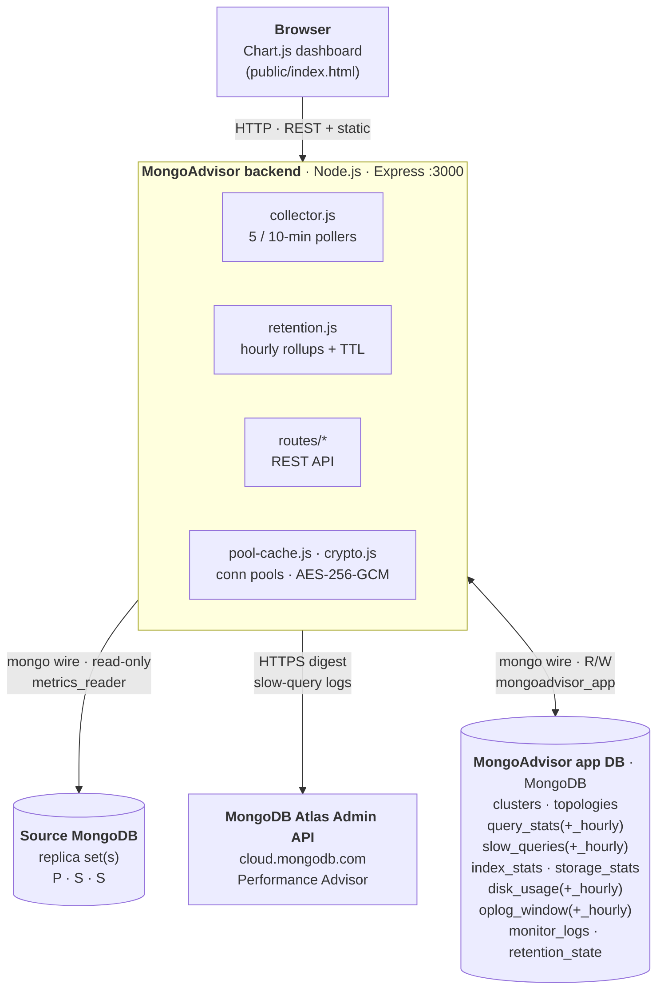

# MongoAdvisor

MongoAdvisor rethinks MongoDB observability. Instead of yet another raw-metrics
dashboard or auditing tool, it continuously analyzes your clusters and delivers
**actionable recommendations** with direct links to the exact playbook —
turning insight into action in seconds, not hours. So you can keep innovating
and scaling.

> **Status & scope.** MongoAdvisor is **under active development**. It does
> **not** replace
> [Atlas Metrics](https://www.mongodb.com/docs/atlas/monitoring-alerts/) or
> [Atlas Performance Advisor](https://www.mongodb.com/docs/atlas/performance-advisor/) —
> it sits **on top of them** and is built for **complex, multi-tenant
> environments** where one Atlas project view is no longer enough. It adds:


**What it collects (per registered cluster):**

- [`$queryStats`](https://www.mongodb.com/docs/manual/reference/operator/aggregation/queryStats/)
  per replica-set member (topology discovered via `hello`).
- [Atlas Performance Advisor](https://www.mongodb.com/docs/atlas/performance-advisor/)
  slow-query log lines (optional — requires a read-only Atlas API key).
- `$indexStats`, `collStats`, `dbStats` for unused/redundant-index and
  storage/fragmentation views.
- Oplog window (first / last `ts` on `local.oplog.rs`) and disk usage.

All telemetry is persisted to a central MongoDB database and surfaced in a
browser dashboard served from the same Node process.

## Spot the most impactful operations

**Impact = exec count × latency**, not latency alone. The bubble chart
plots count vs. avg latency, bubble size = total time → the biggest bubble
is the worst offender. IO + CPU heatmaps group the same shapes by
`appName` to show bytes-bound vs. CPU-bound at a glance.

[![Slowest query impact bubble + IO and CPU heatmaps by appName][impact-img]][impact-img]

> If the image above doesn't render, open it directly:
> [docs/images/slowest-impact-and-heatmaps.jpg](docs/images/slowest-impact-and-heatmaps.jpg).

## Drill into the slow stage

Click any slow query → MongoAdvisor runs
[`explain("executionStats")`](https://www.mongodb.com/docs/manual/reference/method/cursor.explain/)
read-only and breaks the pipeline into per-stage `self` / cumulative time
with the slowest stage highlighted. Here `#6 $lookup` owns the entire
12.6 s — fix the foreign-collection index, not the pipeline.

[![Explain modal — per-stage execution plan breakdown for a slow aggregation][explain-img]][explain-img]

> If the image above doesn't render, open it directly:
> [docs/images/explain-stage-breakdown.jpg](docs/images/explain-stage-breakdown.jpg).

Selectable verbosity, per-call `timeoutMS`, transparent fallback to the
rollup exemplar when raw rows have been TTL'd. Full filter & chart
reference: [docs/dashboard.md](docs/dashboard.md).

## Detect unused & redundant indexes — with fix scripts

`$indexStats` flags **unused** indexes (0 ops since the last server start)
and **redundant** ones (key is a strict prefix of another). Each panel
ships a one-click **fix recommendation** with copy-paste mongosh scripts:
*hide* first, drop after one business cycle.

[![Unused & redundant indexes panel with hide / drop recommendations][indexes-img]][indexes-img]

> If the image above doesn't render, open it directly:
> [docs/images/unused-and-redundant-indexes.jpg](docs/images/unused-and-redundant-indexes.jpg).

Two buttons: **Generate hide-index scripts** (runs
[`collMod` + `hidden: true`](https://www.mongodb.com/docs/manual/core/index-hidden/))
and **Generate drop-index scripts**. Workflow details:
[docs/dashboard.md](docs/dashboard.md).

[impact-img]: docs/images/slowest-impact-and-heatmaps.jpg
[explain-img]: docs/images/explain-stage-breakdown.jpg
[indexes-img]: docs/images/unused-and-redundant-indexes.jpg

## Documentation map

This README is a **5-minute onboarding** doc. The deep dives live under
[`docs/`](docs):

| Topic                                                 | Doc                                              |
| ----------------------------------------------------- | ------------------------------------------------ |
| Atlas bootstrap, users & roles, env vars, encryption  | [docs/setup.md](docs/setup.md)                   |
| Collector internals, dedupe, slow-query watermark     | [docs/collector.md](docs/collector.md)           |
| Retention, hourly rollups, sizing, runbook            | [docs/retention.md](docs/retention.md)           |
| Workload scripts + Atlas sample-data prerequisite     | [docs/workloads.md](docs/workloads.md)           |
| HTTP API endpoints & query parameters                 | [docs/api.md](docs/api.md)                       |
| Dashboard charts, filters, empty-state badges         | [docs/dashboard.md](docs/dashboard.md)           |
| Project layout, unit tests, roadmap                   | [docs/development.md](docs/development.md)       |

## Supported targets and requirements

- **Topology:** replica sets are fully supported today. Sharded-cluster
  support is on the [roadmap](docs/development.md#roadmap) — Atlas `mongos`
  processes are filtered out by the collector.
- **Monitored server version:** **MongoDB 7.0** is the floor — topology
  discovery, `$indexStats`, `collStats`, `dbStats`, oplog window, and Atlas
  Performance Advisor slow-query ingestion all work. The `$queryStats`-driven
  charts require **MongoDB 7.1+** (the operator was introduced there); on
  7.0 the collector detects the gap at discovery, sets
  `topologies.queryStatsSupported === false`, and skips that one poll each
  cycle.
- **High-catalog safety rail:** clusters whose
  `serverStatus.catalogStats.collections` exceeds **10,000** are flagged
  `catalogTooLarge: true` at discovery. The per-namespace pollers
  (`storage_stats` daily, `$indexStats` every 10 min) are automatically
  paused for that cluster. The UI surfaces a **⚠ N collections — heavy
  scans skipped** badge with a link to the
  [Reduce the Number of Collections](https://www.mongodb.com/docs/manual/data-modeling/design-antipatterns/reduce-collections/#reduce-the-number-of-collections)
  anti-pattern doc. Mechanics:
  [docs/collector.md](docs/collector.md#topology-discovery-and-atlas-dns-aliases).

## Architecture

Five logical components, three external boundaries (mongo wire, HTTPS to
Atlas, HTTP to the browser):



**Component boundaries:**

| Component                | Process      | Storage     | Notes                                                                                              |
| ------------------------ | ------------ | ----------- | -------------------------------------------------------------------------------------------------- |
| **Frontend**             | Browser      | —           | Static assets served by the backend; talks to it over the same origin.                             |
| **MongoAdvisor backend** | Node.js      | —           | Stateless; horizontal scaling is fine but pollers must run on one instance (leader-elect TODO).    |
| **MongoAdvisor app DB**  | MongoDB      | persistent  | A separate cluster from the ones you monitor — sized per [docs/retention.md](docs/retention.md#cluster-sizing-for-the-mongoadvisor-app-db). |
| **Source clusters**      | MongoDB      | (yours)     | Connected via per-cluster pools using the registered `metrics_reader` URI; never written to.        |
| **Atlas control plane**  | external SaaS| —           | Optional; only used when an Atlas API key pair is registered for a cluster.                         |

Slow-query log lines come from the **Atlas Admin API** path (keys held by
the backend, never the source cluster), so dropping Atlas keys disables
slow-log ingestion without affecting any other collector.

## Quick Start

For a **brand new** Atlas deployment, follow the six-step
[Bootstrap (Atlas)](docs/setup.md#bootstrap-atlas) guide which creates the
two database users and one Atlas API key MongoAdvisor needs.

When users and keys **already exist**:

```bash
npm install
cp .env.example .env
# Edit .env — at minimum set MONGO_URI, MONGO_DB, ENCRYPTION_KEY.
# Generate ENCRYPTION_KEY:
#   node -e "console.log(require('crypto').randomBytes(32).toString('hex'))"

# Create the indexes the collector relies on (idempotent)
npm run indexes:ensure

# Start the server (use `npm run dev` for watch mode)
npm start
```

Dashboard: <http://localhost:3000> (or your `PORT`). The header shows a
status badge driven by `/api/health`. Register your first cluster under
**Monitored Clusters** — full field reference is in
[docs/setup.md — Register the monitored cluster](docs/setup.md#6-register-the-monitored-cluster-in-the-ui).

### Required environment variables

The bare minimum to start the application:

| Variable         | Purpose                                                                                                            |
| ---------------- | ------------------------------------------------------------------------------------------------------------------ |
| `MONGO_URI`      | Connection string for the **MongoAdvisor application** database. On Atlas, must include `authSource=admin`.       |
| `MONGO_DB`       | Application database name (default `mongoadvisor`).                                                                |
| `ENCRYPTION_KEY` | 64 hex chars — encrypts stored cluster URIs and Atlas private keys in the app DB.                                  |
| `PORT`           | Optional (default `3000`).                                                                                         |

Full list (retention, slow-query watermark, workload override, etc.):
[docs/setup.md — Environment variables](docs/setup.md#environment-variables).

## Generate workload (optional)

The dashboard is more interesting once you've put some traffic on a monitored
cluster. The scripts in `scripts/workload*.js` target Atlas's built-in
[**sample datasets**](https://www.mongodb.com/docs/atlas/sample-data/)
(`sample_airbnb`, `sample_mflix`), so the **prerequisite** is loading sample
data — see
[Load sample data into Atlas](https://www.mongodb.com/docs/atlas/sample-data/load-sample-data/#std-label-load-sample-data).

Then, from a shell with `.env` configured:

```bash
# Fast, sustained mixed workload (5 workers × 5 minutes by default)
node scripts/workload-fast.js

# Index-only fast loops
node scripts/workload-mflix-fast.js
node scripts/workload-fast-agg.js
```

Full script catalog, environment variables, the dedicated workload database
user, and how to expand `sample_airbnb.listingsAndReviews_big` for heavier
runs: [docs/workloads.md](docs/workloads.md).

## Data collection at a glance

Embedded pollers run on fixed intervals (see
[`src/collector.js`](src/collector.js); deep dive in
[docs/collector.md](docs/collector.md)):

| Collector                             | Interval                  | Stored as       |
| ------------------------------------- | ------------------------- | --------------- |
| Topology discovery                    | 5 min + on URI change     | `topologies`    |
| `$queryStats`                         | 5 min                     | `query_stats`   |
| Atlas slow query logs                 | 5 min                     | `slow_queries`  |
| `$indexStats` (unused / redundant)    | 10 min                    | `index_stats`   |
| Disk usage (`dbStats`)                | 5 min                     | `disk_usage`    |
| Oplog window                          | 5 min                     | `oplog_window`  |
| Storage & fragmentation (`collStats`) | Daily ~3:00 local         | `storage_stats` |

Time-series collections are kept hot for `RETENTION_RAW_DAYS` (default 7),
aggregated into hourly `*_hourly` rollups, then TTL-purged. Dashboards
transparently `$unionWith` the rollups for older ranges — see
[docs/retention.md](docs/retention.md).

## Security

Source cluster URIs and Atlas private API keys are **encrypted at rest**
(AES-256-GCM, per-value 12-byte IV) before storage in the backend database.
The `GET /api/clusters` endpoint always returns masked / partial values; the
plaintext lives only in `POST /api/clusters` request bodies and decrypted
in-process. Full details, key rotation, and the
`npm run decrypt:field` recovery script:
[docs/setup.md — Credential encryption](docs/setup.md#credential-encryption).

## License

ISC — see [`package.json`](package.json).
