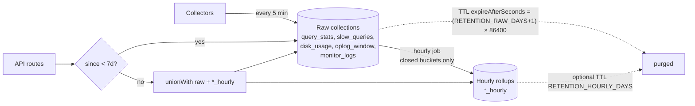

# Retention reference

Time-series collections written by the [collector](collector.md) are kept hot
for `RETENTION_RAW_DAYS` (default **7 days**), then aggregated into hourly
`*_hourly` rollups before MongoDB TTL purges the raw rows. The rollup
collections survive long-term so dashboards can answer questions about older
ranges without storing every individual snapshot.

The module is `[src/retention.js](../src/retention.js)`. It is started by
`[src/server.js](../src/server.js)` right after the collector and writes audit
rows to `monitor_logs` like every other collector.

## Goals and scope

- Raw rows in `query_stats`, `slow_queries`, `disk_usage`, `oplog_window`,
`monitor_logs` are removed `RETENTION_RAW_DAYS + 1` days after their
`timestamp` via a MongoDB TTL index.
- Before they expire, each closed hour bucket is aggregated into the matching
`*_hourly` collection.
- Dashboards keep working across the boundary: routes that filter on a
`since` predating the cutoff transparently `$unionWith` the rollup.
- Snapshot-replace collections (`index_stats`, `storage_stats`) are **out of
scope** — they're rewritten in full every poll so they prune themselves.

## Data flow




Two safety properties:

- **TTL is `RAW_TTL_DAYS + 1`**: the rollup job runs hourly and only consumes
buckets older than `now − ROLLUP_SAFETY_BUFFER_HOURS` (default 2 h). Even if
the job is stalled for a day, raw data is still present when it recovers.
- **Rollup is idempotent**: every bucket is upserted under a unique key
`(clusterId, host, …, bucketStart)` so re-running the same hour is a no-op.
A watermark in `retention_state` records progress so restarts resume.

## Configuration

All values live in `[.env.example](../.env.example)`. The retention module
reads them once at startup; restart the service to pick up changes.


| Env var                      | Default     | Effect                                                                                                        |
| ---------------------------- | ----------- | ------------------------------------------------------------------------------------------------------------- |
| `RETENTION_ENABLED`          | `true`      | Set to `false` to skip rollup and TTL setup entirely.                                                         |
| `RETENTION_RAW_DAYS`         | `7`         | TTL on raw collections is `(RETENTION_RAW_DAYS + 1) × 86400` seconds. The +1 day is the rollup safety buffer. |
| `RETENTION_HOURLY_DAYS`      | `0`         | If > 0, rollups also TTL after this many days. `0` keeps them forever.                                        |
| `ROLLUP_INTERVAL_MS`         | `3_600_000` | Cadence of `runRollupOnce`. Default hourly.                                                                   |
| `ROLLUP_SAFETY_BUFFER_HOURS` | `2`         | Don't roll up the most recent N hours — leaves time for late-arriving rows.                                   |


## Schema for rollup collections

### `query_stats_hourly`

`query_stats` counters are **cumulative** since `metrics.metricsSinceFirstSeen`.
Naively summing across raw rows in a bucket would double-count. The rollup
computes deltas per `(clusterId, host, keyHash, queryShapeHash)` series within
each hour — see [Delta-fold algorithm](#delta-fold-algorithm) below.

```js
{
  bucketStart: ISODate,           // hour-aligned UTC
  bucketEnd: ISODate,
  clusterId, clusterName, host,
  appName, namespace, queryShapeHash, comment, keyHash,
  queryShapeSample: { ... },      // last queryShape seen — drives the UI "command" column
  observationCount: <int>,        // raw rows folded into this bucket
  execCount: <long>,              // sum of positive deltas of cumulative execCount
  totalExecMicros: <long>,
  docsExamined: <long>,
  keysExamined: <long>,
  firstResponseExecMicros: { min, max, sum, sumOfSquares },
  lastExecutionMicrosMax: <long>,
  rolledUpAt: ISODate,
}
```

Unique key: `(clusterId, host, queryShapeHash, bucketStart)`.

### `slow_queries_hourly`

Slow-query rows are per-event, so the rollup groups by
`(clusterId, host, queryHash, planSummary)` and preserves the slowest op as an
**exemplar** so the Explain popup keeps working after raw is purged.

```js
{
  bucketStart, bucketEnd,
  clusterId, clusterName, host,
  appName, namespace, queryHash, planSummary, comment,
  count: <int>,
  totalMillis, avgMillis, maxMillis,
  totalCpuNanos, totalBytesRead,
  totalDocsExamined, totalKeysExamined, totalNreturned,
  exemplar: {                    // slowest event in the bucket
    timestamp, millis,
    command, originatingCommand,
    raw                          // truncated to 4 KB
  },
  rolledUpAt,
}
```

Unique key: `(clusterId, host, queryHash, planSummary, bucketStart)`.

### `disk_usage_hourly` and `oplog_window_hourly`

Both store min/avg/max per cluster per hour. Tiny — one row per cluster per
hour, ~200 B compressed.

```js
{
  bucketStart, bucketEnd, clusterId, clusterName,
  fsTotalSizeBytes: { min, max, avg },
  fsUsedSizeBytes:  { min, max, avg },
  usagePct:         { min, max, avg },
  samples: <int>, rolledUpAt
}
```

## Delta-fold algorithm

`query_stats.execCount` and friends are cumulative monotonic counters that
grow until either:

1. the shape's entry is evicted from the in-memory `$queryStats` store, or
2. the server restarts.

Both events reset the counter. The rollup folds an array of consecutive
snapshots `[v_0, v_1, …, v_n]` (already sorted by `timestamp` inside the
bucket) into a single delta:

```
total = 0
prev  = null
for v in values:
    if prev is null:
        total += v             # first snapshot — counter value so far
    elif v >= prev:
        total += v − prev      # monotonic growth
    else:
        total += v             # counter reset — start a new series
    prev = v
return total
```

Implemented in `[src/retention.js](../src/retention.js)` as
`sumPositiveDeltas`. Applied to `execCount`, `totalExecMicros`,
`docsExamined`, `keysExamined`. The histogram-style
`firstResponseExecMicros` is preserved as
`{ min: $min, max: $max, sum: $max, sumOfSquares: $max }` — taking `$max` on
the cumulative `sum`/`sumOfSquares` is a conservative-but-correct bound
because they're already cumulative within the bucket.

## API behaviour across the boundary

[`src/routes/metrics.js`](../src/routes/metrics.js) exports two pipeline-prefix
helpers that each metric route uses. Both branch on the requested `since`:

| Case | Trigger | Pipeline shape |
| --- | --- | --- |
| **Hot only** | `since >= rawHotCutoff` (5 min / 1 h / 1 d UI filters) | `[{ $match }]` — raw collection only, no `$unionWith`. |
| **Hybrid** | `since < rawHotCutoff` (e.g. a custom range that crosses the cutoff, or anything older than `RETENTION_RAW_DAYS`) | `[{ $match: rawMatch }, { $unionWith: *_hourly … bucketStart ∈ [since, cutoff) }]`. |
| **All** | `since` is omitted entirely (the dashboard's **All** button → `<button data-val="">`) | `[{ $match: rawMatch }, { $unionWith: *_hourly … bucketStart < cutoff }]` — the rollup branch covers **all** history before the cutoff. Without this branch, "All" would silently cap at `RETENTION_RAW_DAYS` once raw TTL has fired. |

- `buildQueryStatsPipelinePrefix(filter)` projects `bucketStart → timestamp`
  on the rollup branch and aliases pre-aggregated fields back to raw column
  names. Downstream `$group/$sum` stages work unchanged because pre-summed
  delta + raw delta `Σ` correctly across the boundary.

- `buildSlowQueriesPipelinePrefix(filter)` emits `_weight` and `_total*`
  fields on every row (1 / `millis` for raw, `count` / `totalMillis` for
  rollup). Downstream pipelines use `$sum: "$_weight"` instead of `$sum: 1`,
  and recompute averages **after** `$group` as `totalMillis / count` to stay
  correct across mixed weights. Min/max use `_maxMillis`.

The `/slow-queries` route applies the same three-case branch directly (it
needs a different rollup projection that surfaces `exemplar.command` /
`exemplar.raw` so the UI table can still render).

The `/slow-query-sample` endpoint that backs the Explain popup falls back to
`slow_queries_hourly.exemplar` when no raw row matches, marking the result
`_fromRollup: true` so the UI can warn the user that the body comes from a
rollup exemplar (no `id`, possibly truncated `raw`).

Coverage for all three cases lives in
[`tests/metrics-pipeline.test.js`](../tests/metrics-pipeline.test.js) — see
[Unit tests](development.md#unit-tests) in the development doc.

## Sizing model

`query_stats` is dominated by the `queryShape` and `metrics` subdocuments and
grows with shape cardinality, not ops:

```
query_stats rows/day  =  H × N × α × 288
                          ▲   ▲   ▲   ▲
                          │   │   │   └── polls per day (5-min interval)
                          │   │   └────── fraction of shapes whose latestSeenTimestamp
                          │   │           advances each poll (idle shapes don't add rows)
                          │   └────────── distinct active query shapes
                          └────────────── replica members polled (3 for RS, 3×shards+mongos)
```

`slow_queries` is bounded by the Atlas Performance Advisor cap
(`nLogs=2000` per host per call):

```
slow_queries rows/day  ≤  min( slow_rate × ops × 86400,  H × 2000 )
                       ≈  H × 2000   on any busy cluster   (Atlas truncates to top-N)
```

### Production-calibrated reference (3000 ops/sec, 3-node RS)

Calibrated against a real cluster sample (24 h CSVs from Atlas Query Insights +
Performance Advisor): top namespace 1,010 ops/s; slow ops 170 k/24 h with one
namespace responsible for 94 % of them; workload is transactional, not
aggregation-heavy. Assumptions: H = 3, N ≈ 600, α ≈ 0.7, avg `queryShape` ≈
3 KB, avg `slow_queries` row ≈ 6 KB, WT zstd ratio ~3×.


| Collection                                     | Rows/day | Compressed/day | 1 week compressed |
| ---------------------------------------------- | -------- | -------------- | ----------------- |
| `query_stats` (raw + idx)                      | ~363 k   | ~550 MB        | ~3.9 GB           |
| `slow_queries` (raw + idx)                     | ~170 k   | ~520 MB        | ~3.7 GB           |
| `disk_usage` + `oplog_window` + `monitor_logs` | ~1 k     | <2 MB          | <15 MB            |
| **Raw 7-day hot tier total**                   |          | **~1.1 GB**    | **~7.6 GB**       |
| `query_stats_hourly`                           | ~43 k    | ~15 MB         | ~110 MB           |
| `slow_queries_hourly`                          | ~3 k     | ~6 MB          | ~45 MB            |
| **Long-term retained per week**                |          |                | **~155 MB**       |


Steady-state after the first 7 days: ~155 MB/week kept forever = ~8 GB/year
of history per cluster.

Knobs that swing the estimate: **N** (×2), avg `queryShape` size (×2),
`slow_queries` per-row size driven by `raw` log truncation behaviour (×2).
The measurement script described next replaces inferred numbers with
measured ones.

### Measurement script

`[scripts/measure-retention-footprint.js](../scripts/measure-retention-footprint.js)`
is a read-only sizing report. It reads `collStats` and a few cheap
aggregations from the application DB and extrapolates 1 day / 1 week /
1 month / 1 year footprints based on the observation window present in the
data.

```bash
node scripts/measure-retention-footprint.js
# or to force a window when the data has a known starting point:
node scripts/measure-retention-footprint.js --hours-observed 6
```

Outputs per raw collection: row count, avg BSON obj size, logical size,
compressed `storageSize`, index size, derived rows/hour, distinct shapes
(for `query_stats`), distinct query hashes (for `slow_queries`), and an
observed-α approximation. Then a linear extrapolation table.

**Generating load for a meaningful measurement.** The collector polls the
*monitored* cluster (registered via `POST /api/clusters`), so for the
measurement script to see meaningful row counts the monitored cluster must
have traffic. Two patterns:

```bash
# Heavy-aggregation mix (one Node child per iteration — keep iter counts modest!)
node scripts/workload.js 30                           # ~90 child runs across 3 scripts

# Sustained fast-workload (N parallel long-running workers — preferred for sizing)
node scripts/workload-fast.js 5 600                   # 5 workers × 10 min, ~25 ops/sec total
MIN_SLEEP_MS=0 MAX_SLEEP_MS=20 \
  node scripts/workload-fast.js 8 1800                # 8 workers × 30 min, ~400 ops/sec total
```

Wait at least 2 collector polls (~10 min) past the last workload run so
latest counters land, then run the measurement script.

> Do **not** use `node scripts/workload.js 3000`-style huge iteration counts —
> that spawns thousands of child Node processes simultaneously and triggers
> outbound socket exhaustion (`ENETUNREACH`), TLS handshake failures, and
> file-descriptor pressure (`spawn EBADF`) on the client. Use
> `workload-fast.js` for sustained throughput instead — it spawns a small
> fixed pool of long-running workers with persistent connection pools.

What matters for *sizing* is shape diversity and per-row size, not raw ops
rate — a 30-minute mixed run produces enough shapes for the projection to
stabilize.

## Cluster sizing for the MongoAdvisor app DB

Calibrated numbers per monitored cluster: ~20 GB year-1, ~30 GB year-2,
working set ~3.5 GB. **Start on Atlas M30** (8 GB RAM, 40 GB storage, 2 vCPU)
with compute auto-scaling **M30 ↔ M50** and storage auto-scaling on. M20
would fit year-1 but its 4 GB RAM leaves a too-small WiredTiger cache for
dashboard aggregations.

Step up to **M40** when:

- 5+ monitored clusters added;
- dashboard p95 exceeds ~2 s (CPU- or IOPS-bound);
- `query_stats_hourly` rollup row count climbs past ~1 M.

For multi-monitored-cluster setups: storage scales linearly with cluster
count, RAM mostly does not. 10 clusters → roughly M40 territory.

## Operational runbook

### How to inspect rollup state

```js
// Watermark — the latest hour processed
db.retention_state.findOne({ _id: "watermark" })

// Recent audit rows (success + skipped + errors)
db.monitor_logs.find({ action: "retention.rollup" }).sort({ timestamp: -1 }).limit(20)

// What's in a specific hour
db.query_stats_hourly.find({
  bucketStart: ISODate("2026-05-12T10:00:00Z")
}).count()
```

### How to disable retention temporarily

Set `RETENTION_ENABLED=false` and restart. The TTL indexes stay in place
(MongoDB still purges), but the rollup job stops running. To stop **both**
TTL and rollup, drop the `ttl_timestamp` indexes manually before disabling.

### How to re-run a specific bucket

The rollup writes the same documents on every run for the same bucket, so
it's safe to manipulate the watermark:

```js
// Re-roll the last 24 hours by rewinding the watermark
db.retention_state.updateOne(
  { _id: "watermark" },
  { $set: { lastRolledUpHour: new Date(Date.now() - 25 * 3600_000) } }
)
```

Then either wait for the next `ROLLUP_INTERVAL_MS` tick or call
`runRollupOnce` directly from a one-off Node script.

### How to add a new collection to the retention pipeline

1. Add the collection name to the TTL loop in
  `src/retention.js#ensureRetentionIndexes` and the TTL block in
   `scripts/ensure-indexes.js`.
2. Write a `rollup<Name>Hour(bucketStart)` function modelled on
  `rollupDiskUsageHour`.
3. Add it to the `Promise.all` in `rollupHour`.
4. Define `<name>_hourly` indexes in both
  `ensureRetentionIndexes` and `ensure-indexes.js`.
5. If the collection backs an API route, add a union-pipeline helper to
  `src/routes/metrics.js` and switch the route to use it.

### Failure modes and what they mean


| Symptom                                                                                  | Likely cause                              | Fix                                                                                                                                                |
| ---------------------------------------------------------------------------------------- | ----------------------------------------- | -------------------------------------------------------------------------------------------------------------------------------------------------- |
| `runRollupOnce` returns `{ skipped: "no_data" }` forever                                 | No raw rows yet                           | Wait for the collector to populate. Run a workload.                                                                                                |
| `runRollupOnce` returns `{ skipped: "up_to_date" }` continuously and `*_hourly` is empty | Watermark is ahead of where you expect    | Inspect `retention_state.watermark` — if wrong (e.g. someone set it manually), rewind it as above.                                                 |
| Aggregation runs but `*_hourly` row count drops                                          | Raw TTL fired before rollup for that hour | Check `monitor_logs` for `retention.rollup` error rows; consider increasing `RETENTION_RAW_DAYS` so the +1-day buffer is larger.                   |
| TTL not deleting                                                                         | TTL index missing or wrong field          | Verify with `db.<coll>.getIndexes()`. The `ttl_timestamp` index should have `expireAfterSeconds`. Drop and re-create via `npm run indexes:ensure`. |
| Dashboard returns empty for old `since`                                                  | Rollup branch returned no docs            | Confirm `*_hourly` has rows for that range; confirm the union pipeline matches `bucketStart` against the filter's `since`.                         |


